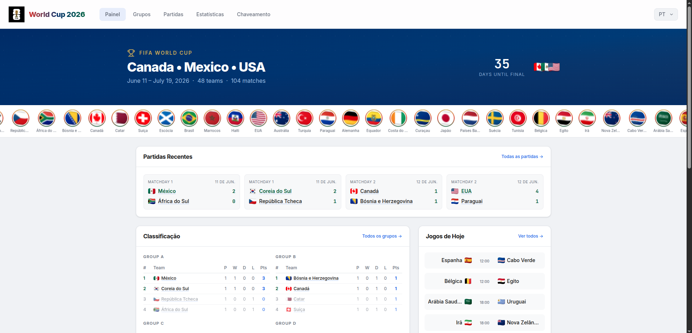

# World Cup 2026

Full-stack SPA for exploring FIFA World Cup 2026 data — group standings, fixtures, top scorers, team profiles, and the knockout bracket.



## Features

- **Dashboard** — Hero with dynamic countdown, stories bar (48 team flags), recent matches, group standings, top scorers
- **Groups** — Complete tables for all 12 groups with positions, points, goal difference, qualification indicators
- **Matches** — Filterable fixture list (by round/group); compact mobile view with flags only
- **Stats** — Top scorers ranking and per-group match/goal summary
- **Team** — Per-team detail with gradient header from flag colors, match history, goal log
- **Bracket** — Knockout tree with final, third-place match, and trophy highlight
- **i18n** — English and Portuguese with locale persistence (`localStorage`)
- **Responsive** — Mobile-first layout with right-sliding sidebar (80% width, 100% height)

## Tech stack

| Layer | Technology |
|-------|-----------|
| Frontend | Vue 3 (Composition API, `<script setup>`) |
| Build | Vite 6 |
| Styling | Tailwind CSS v4 (`@theme` tokens, zero scoped CSS) |
| i18n | vue-i18n (EN/PT) |
| Routing | vue-router (hash-based SPA) |
| Animations | motion-v (page transitions, entrance effects) |
| Backend | Python 3.12, FastAPI |
| Database | SQLite via SQLAlchemy 2.x |
| Data source | [openfootball/worldcup.json](https://github.com/openfootball/worldcup.json) |

## Quick start

### Backend

```bash
cd backend
python3 -m venv .venv && source .venv/bin/activate
pip install -r requirements.txt
uvicorn main:app --port 8080
```

The API auto-seeds data on first run. Docs at `http://localhost:8080/docs`.

### Frontend

```bash
cd frontend
npm install
npm run dev
```

Opens at `http://localhost:5173`. API requests are proxied to port `8080` via Vite config.

## Project structure

```
world-cup-2026/
├── backend/
│   ├── main.py           — FastAPI app, CORS, lifespan
│   ├── database.py       — SQLite + SQLAlchemy session
│   ├── models.py         — ORM: Team, Stadium, Match, Goal
│   ├── schemas.py        — Pydantic API contracts
│   ├── seed.py           — Download + import from openfootball
│   └── routers/
│       ├── teams.py      — GET /api/teams, /api/teams/:id
│       ├── groups.py     — GET /api/groups
│       ├── matches.py    — GET /api/matches (filters: group, team, round)
│       ├── stats.py      — Top scorers, standings summary
│       └── stadiums.py   — GET /api/stadiums
│
├── frontend/
│   ├── src/
│   │   ├── main.js       — App bootstrap, plugins, global $teamName
│   │   ├── App.vue       — Shell with responsive nav + sidebar
│   │   ├── style.css     — Tailwind @theme, base styles, marquee keyframes
│   │   ├── components/
│   │   │   └── LocaleSwitcher.vue
│   │   ├── views/
│   │   │   ├── Dashboard.vue
│   │   │   ├── Groups.vue
│   │   │   ├── Matches.vue
│   │   │   ├── Stats.vue
│   │   │   ├── Team.vue
│   │   │   └── Bracket.vue
│   │   ├── locales/      — en-US.js, pt-BR.js
│   │   └── utils/        — flags.js, teamColors.js, date.js
│   ├── index.html
│   ├── vite.config.js
│   └── package.json
```

## API endpoints

| Method | Route | Description |
|--------|-------|-------------|
| GET | `/api/` | API info |
| GET | `/api/teams` | All teams |
| GET | `/api/teams/:id` | Team detail |
| GET | `/api/groups` | All group standings |
| GET | `/api/groups/:letter` | Single group |
| GET | `/api/matches` | Matches (filters: `group`, `team`, `round_name`) |
| GET | `/api/matches/:id` | Match detail |
| GET | `/api/stats/top-scorers` | Top scorers (`limit`) |
| GET | `/api/stats/standings-summary` | Group summary |
| GET | `/api/stadiums` | All stadiums |

## Design notes

- **Light theme**: background `#F0F2F5`, white surfaces, accent `#2563EB`
- **Team header gradients**: dynamically generated from each flag's palette via `teamColors.js`
- **Marquee stories bar**: CSS animation (`translateX(-50%)`) with duplicated array for seamless infinite loop
- **Select dropdowns**: custom SVG chevron via inline `style` for consistent cross-browser appearance
- **Team name i18n**: 48 team names mapped in locale files, accessible via `$teamName()` global

## License

MIT
